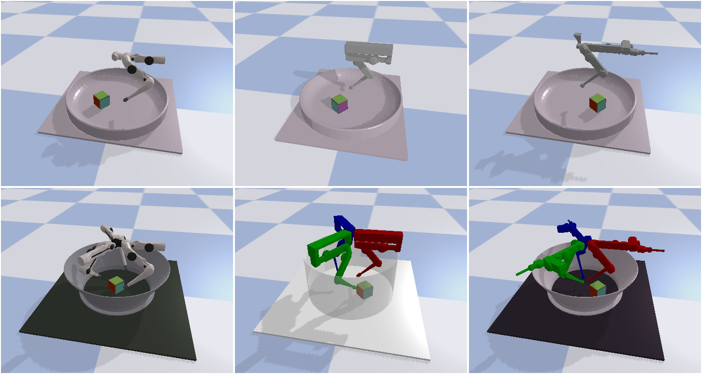

# TriFinger Robot Simulation

Welcome to the official simulation of the TriFinger robots!



## The TriFinger Project

To learn more about the TriFinger robots, check out our official
[project website](https://sites.google.com/view/trifinger), and the
[preprint](https://arxiv.org/abs/2008.03596) of this work.

## Documentation

For instructions on how to install and use this package, see the 
[documentation](https://open-dynamic-robot-initiative.github.io/trifinger_simulation/).


## Cite Us

If you are using this package in you academic work, please cite this repository
and also the corresponding paper:

```
@misc{trifinger-simulation,
  author = {Joshi, Shruti and Widmaier, Felix and Agrawal, Vaibhav and Wüthrich, Manuel},
  year = {2020},
  publisher = {GitHub},
  journal = {GitHub repository},
  howpublished = {\url{https://github.com/open-dynamic-robot-initiative/trifinger_simulation}},
}
```

```
@conference{wuethrich2020trifinger,
  title = {TriFinger: An Open-Source Robot for Learning Dexterity},
  author = {W{\"u}thrich, M. and Widmaier, F. and Grimminger, F. and Akpo, J. and Joshi, S. and Agrawal, V. and Hammoud, B. and Khadiv, M. and Bogdanovic, M. and Berenz, V. and Viereck, J. and Naveau, M. and Righetti, L. and Sch{\"o}lkopf, B. and Bauer, S.},
  booktitle = {Proceedings of the 4th Conference on Robot Learning (CoRL)},
  month = nov,
  year = {2020},
  doi = {},
  url = {https://corlconf.github.io/corl2020/paper_421/},
  month_numeric = {11}
}
```
