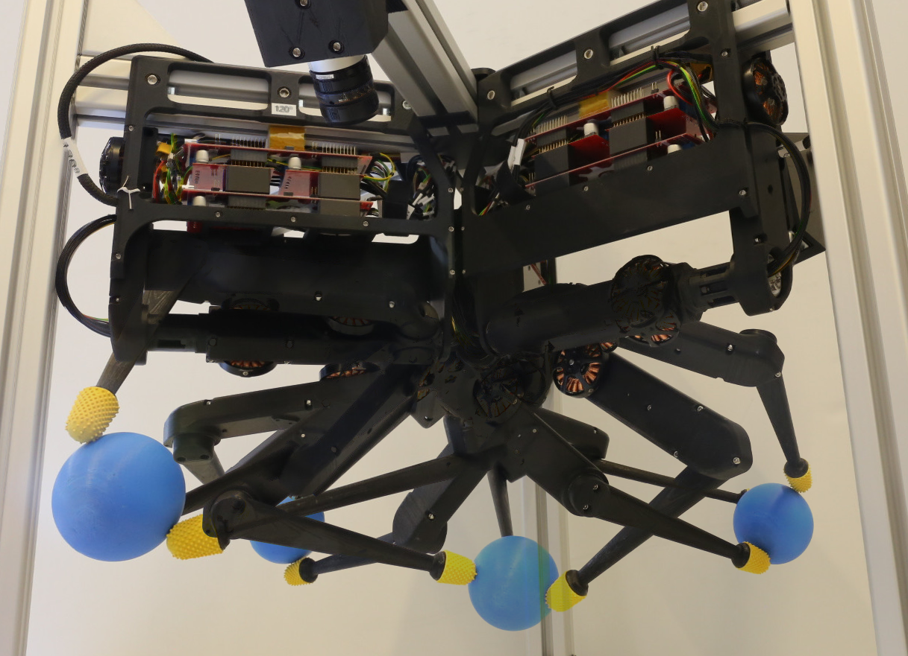
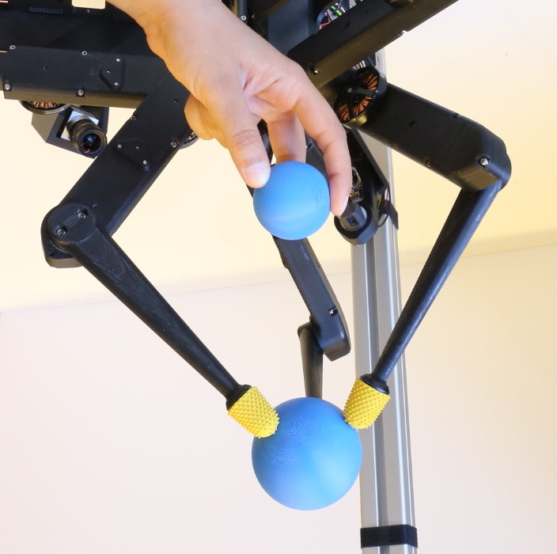

# TriFinger Robot Simulation

Welcome to the official simulation of the TriFinger robots!

<!--  -->
<p float="left">
       
       
</p>

## The Project

To know more about the TriFinger robots, check out our official [project website](https://sites.google.com/view/trifinger), and the [preprint](https://arxiv.org/abs/2008.03596) of this work.

## Documentation

The documentation for this repository is available online [here](https://trifinger-robot-simulation.readthedocs.io/en/latest/)!

## Installation instructions

Find below the installation instructions to install this package as a standalone python package. This package can also be installed as part of a catkin workspace. Please refer to the [installation instructions](docs/installation.rst) for details.

### Prerequisites: Install Anaconda or Miniconda

If not already done, install ``conda`` (Miniconda is sufficient).  To do so, see the
[official documentation](https://docs.conda.io/projects/conda/en/latest/user-guide/install/).

We have tested with conda version 4.8.3.

## Install the trifinger_simulation package

Please refer to the `installation instructions <https://trifinger-robot-simulation.readthedocs.io/en/latest/installation.html>`_.

## Cite Us

If you are using this package in you academic work,
please cite this repository and also the corresponding paper:

```
@misc{trifinger-simulation,
  author = {Joshi, Shruti and Widmaier, Felix and Agrawal, Vaibhav and Wüthrich, Manuel},
  year = {2020},
  publisher = {GitHub},
  journal = {GitHub repository},
  howpublished = {\url{https://github.com/open-dynamic-robot-initiative/trifinger_simulation}},
}
```

```
@misc{wthrich2020trifinger,
    title={TriFinger: An Open-Source Robot for Learning Dexterity},
    author={Manuel Wüthrich and Felix Widmaier and Felix Grimminger and Joel Akpo and Shruti Joshi and Vaibhav Agrawal and Bilal Hammoud and Majid                             Khadiv and Miroslav Bogdanovic and Vincent Berenz and Julian Viereck and Maximilien Naveau and Ludovic Righetti and Bernhard Schölkopf and Stefan Bauer},
    year={2020},
    eprint={2008.03596},
    archivePrefix={arXiv},
    primaryClass={cs.RO}
}
```
