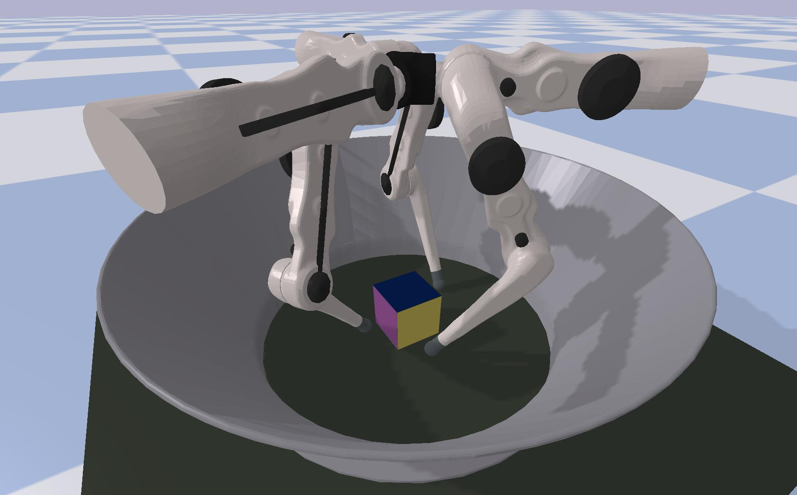

*************************************************
Welcome to the TriFinger Robot Simulation docs!
*************************************************

The trifinger_simulation_ package contains a PyBullet simulation environment
for the different TriFinger robots as well as helper functions for some tasks
(for sampling goals, computing rewards, etc.).

To learn more about the TriFinger robots, check out the `TriFinger project
website`_ and the corresponding paper_.

.. toctree::
   :maxdepth: 2
   :caption: Getting Started

   Installation <getting_started/installation>

.. toctree::
   :maxdepth: 1
   :caption: Ease of Use with a Real Robot

   simreal/simwithreal
   simreal/realwithsim
   simreal/simvsreal
   simreal/timesteplogic

.. toctree::
   :maxdepth: 1
   :caption: API Documentation

   The SimFinger Class <api/sim_finger>
   The TriFingerPlatform Class <api/trifingerplatform>

Indices and tables
==================

* :ref:`genindex`
* :ref:`modindex`
* :ref:`search`

.. raw:: html

   

   <iframe width="560" height="315" src="https://www.youtube.com/embed/xu5VvyjDLRY" frameborder="0" allow="accelerometer; autoplay; encrypted-media; gyroscope; picture-in-picture" allowfullscreen>
   </iframe>
   

Cite Us!
==============

If you are using this package in you academic work,
please cite this repository and also the corresponding paper:

.. code-block:: bibtex

   @misc{trifinger-simulation,
      author = {Joshi, Shruti and Widmaier, Felix and Agrawal, Vaibhav and Wüthrich, Manuel},
      year = {2020},
      publisher = {GitHub},
      journal = {GitHub repository},
      howpublished = {\url{https://github.com/open-dynamic-robot-initiative/trifinger_simulation}},
   }

.. code-block:: bibtex

   @misc{wthrich2020trifinger,
      title={TriFinger: An Open-Source Robot for Learning Dexterity},
      author={Manuel Wüthrich and Felix Widmaier and Felix Grimminger and Joel Akpo and Shruti Joshi and Vaibhav Agrawal and Bilal Hammoud and Majid Khadiv and Miroslav Bogdanovic and Vincent Berenz and Julian Viereck and Maximilien Naveau and Ludovic Righetti and Bernhard Schölkopf and Stefan Bauer},
      year={2020},
      eprint={2008.03596},
      archivePrefix={arXiv},
      primaryClass={cs.RO}
   }

.. _trifinger_simulation: https://github.com/open-dynamic-robot-initiative/trifinger_simulation
.. _`TriFinger project website`: https://sites.google.com/view/trifinger
.. _paper: https://arxiv.org/abs/2008.03596
.. _`Real Robot Challenge`: https://people.tuebingen.mpg.de/felixwidmaier/realrobotchallenge/
.. _`rrc_simulation`: https://github.com/rr-learning/rrc_simulation
