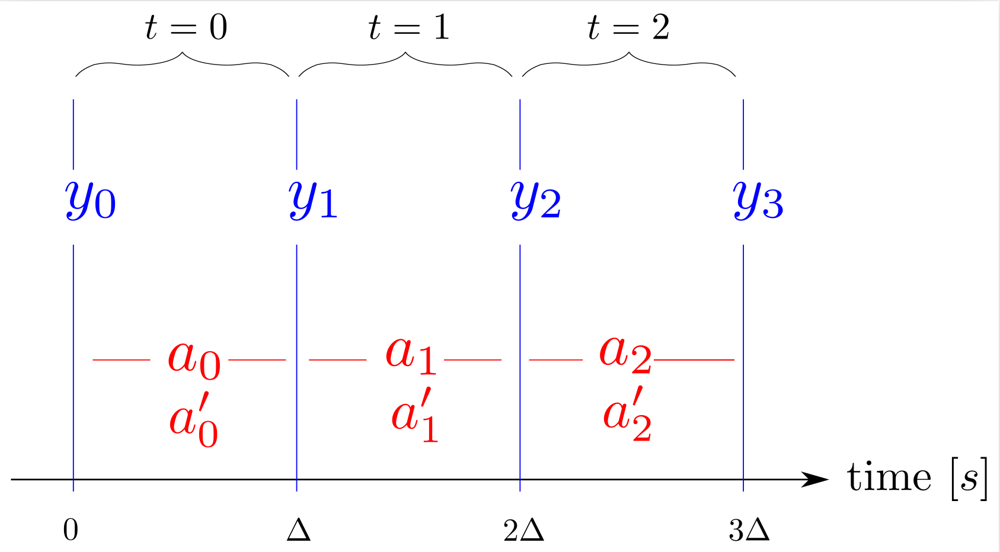

***************************
The TriFingerPlatform Class
***************************

The :class:`~trifinger_simulation.TriFingerPlatform` class provides access to the
simulation of the TriFinger platform using the same interface as for the real
robot.

For a detailed explanation of the software interface on the real robot, and the
logic behind it, please check the `paper
<https://arxiv.org/abs/2008.03596>`_.

On the real robot, we are using *time series* for all robot data like actions
and observations.  The user does not send actions directly to the robot but
appends them to the "desired actions" time series which serves as a queue. 
At each time step, identified by a *time index t*, the action at position *t* is
taken from the "desired actions" time series and processed.  At the same time an
observation is acquired from the robot and added to the "observation" time
series.  This means that the effect of the desired action ``a_t`` is not yet
visible in the observation ``y_t`` as is illustrated below.  (``a'_t``
corresponds to the *applied action*, see `Desired vs Applied Action`_)

In the software, the method
:meth:`~trifinger_simulation.TriFingerPlatform.append_desired_action` is used to
append actions to the time series.  It returns the time index *t* at which the
appended action will be executed.  Methods like
:meth:`~trifinger_simulation.TriFingerPlatform.get_observation` expect a time index as
input and will return the data corresponding to this time step.  If the given
time index refers to a point in the future, these methods will block and wait
until that point is reached.

This allows for very simple code that is automatically executed at the control
rate of the robot:

.. code-block:: python

    platform = trifinger_simulation.TriFingerPlatform()

    zero_torque_action = platform.Action()
    t = platform.append_desired_action(zero_torque_action)
    # get the first observation
    observation = platform.get_robot_observation(t)

    while True:
        action = smart_algorithm_to_compute_next_action(observation)

        t = platform.append_desired_action(action)
        # The t given above refers to the moment the given action will be
        # executed.  Right now, this is in the future, so the following call
        # will automatically wait until the action is actually applied to the
        # platform
        observation = platform.get_robot_observation(t)

As the simulation is not real-time critical, the behaviour is a bit different
here:

- :meth:`~trifinger_simulation.TriFingerPlatform.append_desired_action` will directly
  apply the action and step the simulation.
- There is no actual time series.  The API in the simulation
  follows the same principle to make the transition to the real robot easier.
  However, it is implemented with a buffer size of 1, so the getter methods only
  provide data for the current time step.
- It is possible to access information from *t + 1*.  In a typical gym
  environment, it is expected that the observation returned by ``step(action)``
  belongs to the moment *after* the given action is executed (this corresponds
  to the time index *t + 1*).  To make it easier to get started, we therefore
  allow to access the observations of this time index in the simulation.

For more information on the API of the real robot, see our publication `TriFinger: An Open-Source
Robot for Learning Dexterity <https://sites.google.com/view/trifinger>`_.

Usage Example
=============

.. literalinclude:: ../examples/demo_trifinger_platform_minimal.py

Desired vs Applied Action
=========================

The action given by the user is called the *desired* action.  This action may be
altered before it is actually applied on the robot, e.g. by some safety checks
limiting torque and velocity.  This altered action is called the *applied*
action.  You may use
:meth:`~trifinger_simulation.TriFingerPlatform.get_applied_action` to see what action
actually got applied on the robot.

API Documentation
=================

.. autoclass:: trifinger_simulation.TriFingerPlatform
   :special-members:

   .. automethod:: __init__

   .. method:: Action(torque=None, position=None)

      See :meth:`trifinger_simulation.SimFinger.Action`.

   .. method:: append_desired_action(action)

      See :meth:`trifinger_simulation.SimFinger.append_desired_action`.

   .. method:: get_current_timeindex

      See :meth:`trifinger_simulation.SimFinger.get_current_timeindex`.

   .. method:: get_timestamp_ms(t)

      See :meth:`trifinger_simulation.SimFinger.get_timestamp_ms`.

   .. method:: get_desired_action(t)

      See :meth:`trifinger_simulation.SimFinger.get_desired_action`.

   .. method:: get_applied_action(t)

      See :meth:`trifinger_simulation.SimFinger.get_applied_action`.

   .. method:: get_robot_observation(t)

      Get observation of the robot state (joint angles, torques, etc.).
      See :meth:`trifinger_simulation.SimFinger.get_observation`.

   .. automethod:: get_object_pose

   .. automethod:: get_camera_observation

   .. automethod:: store_action_log

------------------------------------------------------------------------------

.. autoclass:: trifinger_simulation.ObjectPose
   :members:

------------------------------------------------------------------------------

.. autoclass:: trifinger_simulation.CameraObservation
   :members:

------------------------------------------------------------------------------

.. autoclass:: trifinger_simulation.TriCameraObservation
   :members:
